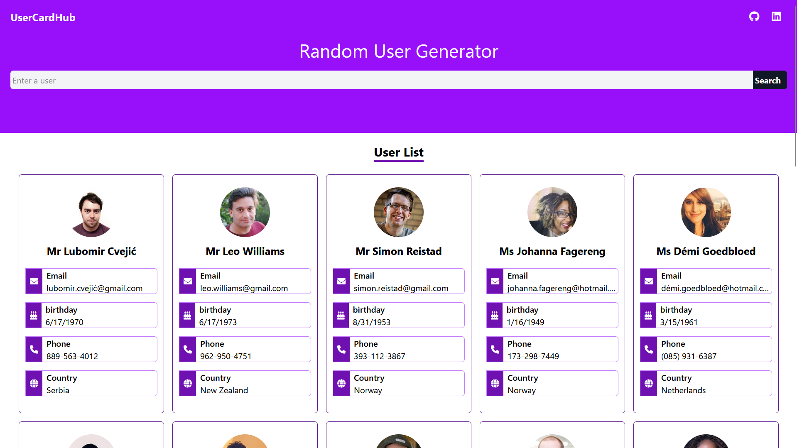

# Random User Cards

A simple and customizable React app that generates random user data and displays it in a card format. It also features a search functionality that allows users to search for specific random users by name. The app is built using React and fetches data from the [Random User Generator API](https://randomuserapi.com/).

## Features

- Fetches random user data from the [Random User Generator API](https://randomuserapi.com/).
- Displays user data such as name, email, location, and picture in a card layout.
- **Search functionality**: Search for specific users by their first or last name.
- Ability to generate new random users on demand.
- Fully responsive design for both desktop and mobile devices.
- Easy to customize and extend.

## Demo

You can view a live demo of the application [here](https://randomusercards.vercel.app/)

## Installation

### Prerequisites

Make sure you have **Node.js** and **npm** (or **yarn**) installed on your machine.

- [Node.js](https://nodejs.org/) (version 12 or higher)
- [npm](https://www.npmjs.com/) (Node Package Manager) or [yarn](https://yarnpkg.com/) (alternative package manager)

### Getting Started

1. Clone the repository to your local machine:

   ```bash
   git clone https://github.com/rougesocket/randomusercards.git
   cd randomusercards
   ```

2. Install the required dependencies:

   ```bash
   npm install
   ```

   Or, using yarn:

   ```bash
   yarn install
   ```

3. Install the required dependencies:

   ```bash
   npm start
   ```

   Or, using yarn:

   ```bash
   yarn start
   ```

4. Open the app in your browser at http://localhost:1234.

### Screenshot


